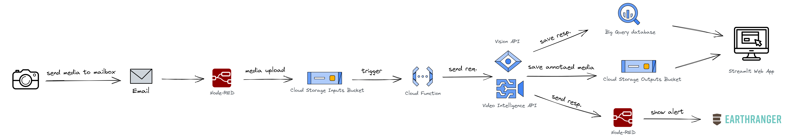

# Smart Parks

<!-- TABLE OF CONTENTS -->

  
Table of Contents

  <ol>
    <li>
      <a href="#about-the-project">About The Project</a>
      <ul>
        <li><a href="#built-with">Built With</a></li>
      </ul>
    </li>
    <li><a href="#usage">Usage</a></li>
    <li><a href="#contact">Contact</a></li>
    <li><a href="#acknowledgments">Acknowledgments</a></li>
  </ol>

<!-- ABOUT THE PROJECT -->
## About The Project

As Artefact, we care about positively impacting people, the environment, and the community. That’s why we are committed to partnering with nonprofit organizations that make these values the basic building blocks of their vision.

Therefore, we collaborated with Smart Parks, a Dutch company that provides advanced sensor solutions to conserve endangered wildlife and efficiently manage park areas by providing cutting-edge technology.

The goal of the project was to use an ML approach to ingest the data coming from the camera traps and then provide insights, such as the presence of people or specific kinds of animals in the images or videos captured by the cameras. This information then is used by the park rangers to better protect the wildlife and sooner detect possible dangers like poachers.

### Built With

- [Cloud Storage](https://cloud.google.com/storage/) - Used to store the camera trap media
- [BigQuery](https://cloud.google.com/bigquery) - Used to store the API responses
- [Cloud Vision API](https://cloud.google.com/vision/) - Used for image analysis 
- [Cloud Video Intelligence API](https://cloud.google.com/video-intelligence/) - Used for video analysis 
- [Cloud Run](https://cloud.google.com/run/) - Used to deploy the Web App
- [Cloud Functions](https://cloud.google.com/functions/) - Used as core component of the workflow
- [Node-RED](https://nodered.org/) - Used to create events in Earth Ranger 
- [Streamlit](https://streamlit.io/) - Used to develop the Web App

<!-- USAGE -->
## Usage

* cloud function: This folder contains the complete cloud function code and all the instructions needed to recreate it in GCP.

* web app: This folder contains the complete streamlit app code and all the instructions needed to deploy it in Cloud Run.

* node red flows: This folder contains the JSON files of used the Node-RED flows and all the instructions needed to import them in your node-RED environment.

<!-- CONTACT -->
## Contact

Simone Gayed Said - simone.gayed-said@artefact.com

Project Link: [https://github.com/artefactory/smartparks](https://github.com/artefactory/smartparks)

<!-- ACKNOWLEDGMENTS -->
## Acknowledgments

* [Medium Article](https://medium.com/artefact-engineering-and-data-science/how-we-deployed-a-simple-wildlife-monitoring-system-on-google-cloud-78b847cab10c)

